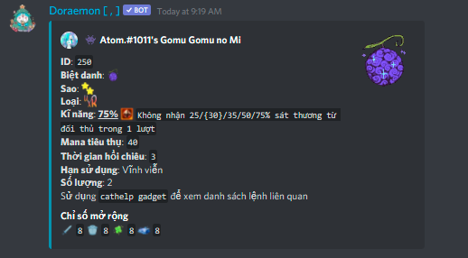

# 💣 Bảo bối


Bạn cần trang bị một nhân vật và weapon để có thể tham gia trận chiến.


## Các lệnh liên quan

* Xem danh sách bảo bối của Cat: `catgg ls`
* Xem danh sách bảo bối của bạn: `catgg`
* Xem thông tin bảo bối của game: `catgg i [ID gốc]`
* Chi tiết bảo bối: `catgg [ID hiện tại]`
* Sử dụng: `catgg use [ID hiện tại]`
* Dung luyện: `catgg cb [ID] [quantity]`
* Nâng cấp: `catup gg [ID hiện tại] [ID gem] [số lượng gem]`
* Bán: `catsell gg [ID] [số lượng]`


ID hiện tại của gg sẽ là: `[Cấp]+[ID gốc]`



Xem đầy đủ các lệnh và thông tin chi tiết liên quan: **`cath gg`**


Ngoài gói **Starter Pack (item 10)** chỉ nhận được 1 lần khi bắt đầu chơi, bạn có thể có bảo bối bằng cách mở rương (item 1) hoặc mua từ người chơi khác.

Bạn có thể nhận rương bảo bối: mua ở shop với giá 25 dora `catbuy 4 [số lượng]` hoặc nhận được khi đánh bại boss.

Bạn có thể mở hòm bảo bối bằng `catuse 4 [số lượng]`

<figure><figcaption></figcaption></figure>

Bạn có thể tìm mua bảo bối bằng cách hỏi trực tiếp ở người chơi khác, hoặc tìm kiếm ở chợ Đô Rề: `catm gg`


Người chơi khi bán qua chợ Đô Rề sẽ phải chịu phí 10%. Các người chơi có Premium Batte 3 / 4 sẽ được miễn khoản phí này.


## Thông tin và chỉ số bảo bối

Để xem đầy đủ chi tiết bảo bối: `catgg i [ID gốc]`\
Xem thông tin chi tiết bảo bối bạn đang có: `catgg [ID hiện tại]`

Các chỉ số:

* **Kỹ năng:**
* **Yêu cầu cấp độ**: Cấp độ hiện tại của nhân vật bạn sở hữu phải đạt ngưỡng này mới có thể sữ dụng bảo bối.
* **Chỉ số mở rộng:** `attack` `defense` `luck` `wisdom` sẽ tăng khi bạn dùng gem nâng cấp (max +10) không tăng lên khi bạn cường hóa.
* Các loại gadget được xếp hạng từ cao tới thấp:            



Lệnh để xem một bảo bối có trong game:

```
catgg i 50
```

***

> **BATTLE GADGET**
>
>  **Gomu Gomu no Mi**
>
> **ID cố định**: `50`\
> **Mô tả**: The Gomu Gomu no Mi is a Paramecia-type Devil Fruit that gives the user's body the properties of rubber, making the user a Rubber Human (ゴム人間 Gomu Ningen?). It was originally a treasure that Shanks and his crew took from an unspecified enemy, but was accidentally eaten by the series protagonist Monkey D. Luffy. In the second version of Romance Dawn, it originally belonged to Luffy's grandpa who took it from an unspecified enemy. -- Custom from 👾 Atom.#1011. - Images by mewiyev
>
> **Loại**: \
> **Kĩ năng**: **75%**  `Không nhận 25/30/35/50/75% sát thương từ đối thủ trong 1 lượt`\
> **Tỉ lệ xuất hiện**: `0.05%`\
> **Mana tiêu thụ**: `40`\
> **Thời gian hồi chiêu**: `3`\
> **Yêu cầu cấp độ**: `15`\
> **Khả năng giao dịch**: `true`\
> **Chỉ dành Premium**: `false`\
> **Ra lò**: `true`
>
> Chỉ số mở rộng `8`  `8`  `8`  `8`



Xem thông tin chỉ số của bảo bối bạn đang sử hữu:

```
catgg 250
```

***

>  👾 Atom.#1011's Gomu Gomu no Mi
>
> **ID**: `250`
>
> **Biệt danh**: \
> **Sao**: \
> **Loại**: \
> **Kĩ năng**: **75%**  `Không nhận 25/{30}/35/50/75% sát thương từ đối thủ trong 1 lượt`\
> **Mana tiêu thụ**: `40`\
> **Thời gian hồi chiêu**: `3`\
> **Hạn sử dụng**: Vĩnh viễn\
> **Số lượng**: 2
>
> Sử dụng `cathelp gadget` để xem danh sách lệnh liên quan
>
> Chỉ số mở rộng  `8`  `8`  `8`  `8`



## Kỹ năng của bảo bối



* **Loại**: 
* **Kĩ năng**: **75%**  `Không nhận 25/{30}/35/50/75% sát thương từ đối thủ trong 1 lượt`
* **Mana tiêu thụ**: `40`
* **Thời gian hồi chiêu**: `3`

Với thông tin kỹ năng, ta có `75%` là ngưỡng sức mạnh của kỹ năng của loại bảo bối , và các số `25/{30}/35/50/75%` là sức mạnh của từng cấp của bảo bối. Với `{xx%}` là sức mạnh hiện tại. Từ 2 con số này ta có thể tính được % sức mạnh của bảo bối bạn sử dụng.\
VD với bảo bối `250` trên ta có: `75%*30% = 22.5%`, tức bạn sẽ không nhận `22.5%` sát thương từ đối thủ trong 1 lượt.

## Dung luyện bảo bối

Cần 4 bảo bối cùng cấp và loại để có thể dung luyện lên cấp tiếp theo: `catgg cb [ID hiện tại] [số lượng]`


Bảo bối sẽ có thể nâng cấp 4 lần - **5\* là cấp cao nhất**



Sau khi **nâng cấp bảo bối** lên level mới, **ID bảo bối sẽ thay đổi** đồng thời các **chỉ số mở rộng** đã được cường hóa **sẽ bị reset**


## Bộ bảo bối gợi ý cho Newbie

Nếu các bạn chưa có đủ thông tin để tự build cho mình một bộ skill thích hợp cho bản thân, cũng như chưa đủ tài nguyên để có cho mình những bảo bối mong muốn. Mình gợi ý cho các bạn một bộ bảo bối có thể gắn bó với bạn lâu dài mà dễ kiếm:



 **Mini Tank:** Như mô tả của nó, chỉ là một bảo bối nhỏ loại **QN** khá dễ kiếm, nhưng mang lại cho bạn khả năng tăng sát thương mỗi 4 turn. Nếu bạn có thể có cho mình 256 mini tank 1\*, bạn có thể dung luyện lên 5\* để có được kỹ năng: Tăng `45% * 90% = 40.5%` Sát thương cơ bản cho đòn đánh tiếp theo.

***

> **BATTLE GADGET**
>
>  Mini Tank
>
> **ID cố định**: `11`\
> **Mô tả**: small tank but big power\
> **Loại**: \
> **Kĩ năng**: **45%**  `Tăng tạm thời 30/35/45/60/90% sát thương bản thân trong 1 lượt`
>
> **Tỉ lệ xuất hiện**: `50%`\
> **Mana tiêu thụ**: `40`\
> **Thời gian hồi chiêu**: `4`\
> **Yêu cầu cấp độ**: `0`\
> **Khả năng giao dịch**: `true`\
> **Chỉ dành Premium**: `false`\
> **Ra lò**: `true`
>
> Chỉ số mở rộng `5`  `5`  `5` &#x20;



**📷 Camera:** Sở hữu kỹ năng cực kỳ hữu dụng cho cả PVP và PVE, hãy thử tưởng tượng bạn copy thành công kỹ năng hạng **`SS`** của Boss mà bình thường bạn không bao giờ được sở hữu và sử dụng nó. ^^.

***

> **BATTLE GADGET**
>
> 📷 Camera
>
> **ID cố định**: `14`\
> **Mô tả**:\
> **Loại**: \
> **Kĩ năng**: **30%**  `Sao chép 01 kĩ năng của đối thủ và sử dụng nó trong 1 lượt với tỉ lệ 30/40/50/60/75%`
>
> **Tỉ lệ xuất hiện**: `80%`\
> **Mana tiêu thụ**: `25`\
> **Thời gian hồi chiêu**: `4`\
> **Yêu cầu cấp độ**: `0`\
> **Khả năng giao dịch**: `true`\
> **Chỉ dành Premium**: `false`\
> **Ra lò**: `true`
>
> Chỉ số mở rộng `5`  `5`  `5`  `5`



**🕰️ Magic Clock:** Bảo bối với kỹ năng cướp lượt đi của đối thủ, giúp bạn nắm cho mình tỷ lệ thắng cao hơn khi có được 2 lượt đi liên tiếp

***

> **BATTLE GADGET**
>
> 🕰️ Magic Clock
>
> **ID cố định**: `5`\
> **Mô tả**:\
> **Loại**: \
> **Kĩ năng**: **30%**  `Cướp lấy lượt đi tiếp theo của đối thủ với tỉ lệ 30/40/50/60/75%`
>
> **Tỉ lệ xuất hiện**: `80%`\
> **Mana tiêu thụ**: `80`\
> **Thời gian hồi chiêu**: `4`\
> **Yêu cầu cấp độ**: `0`\
> **Khả năng giao dịch**: `true`\
> **Chỉ dành Premium**: `false`\
> **Ra lò**: `true`
>
> Chỉ số mở rộng `5`  `5`  `5`  `5`


