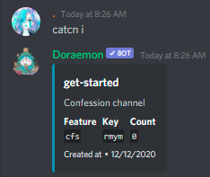

# Get started

## Step by step

### Check current channel info

```
catcn info
```

<div align="left"></div>

### Reset featured channel settings

Reset featured channel settings if you want to use current channel

```
catcn reset
```

### Setup Confession channel in this channel

Setup confession channel and you'll get a **key** (or custom your key by adding it to command)

```
catcn cfs <custom-key>
```

Members will DM Doraemon (with the given key) to confess

### Setup cfs pending channel (Guild Utility option)

Pending channel help you filter out confess message send to your server, ban spammer, ...

```
catchannel cfsp
```

